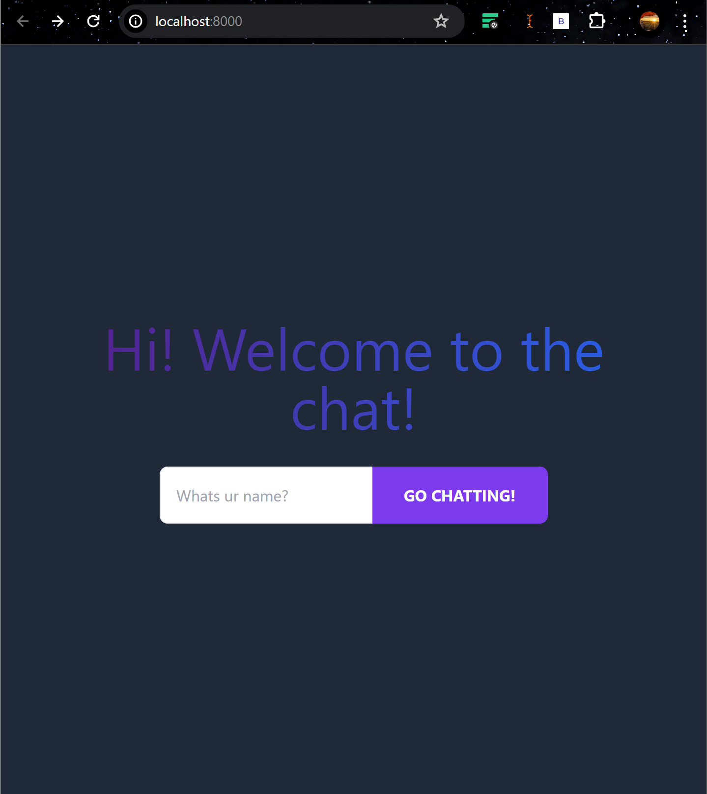
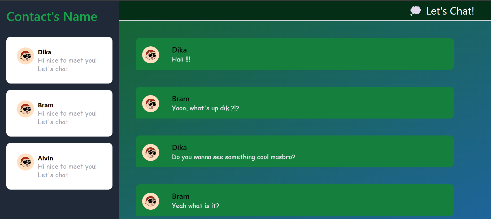
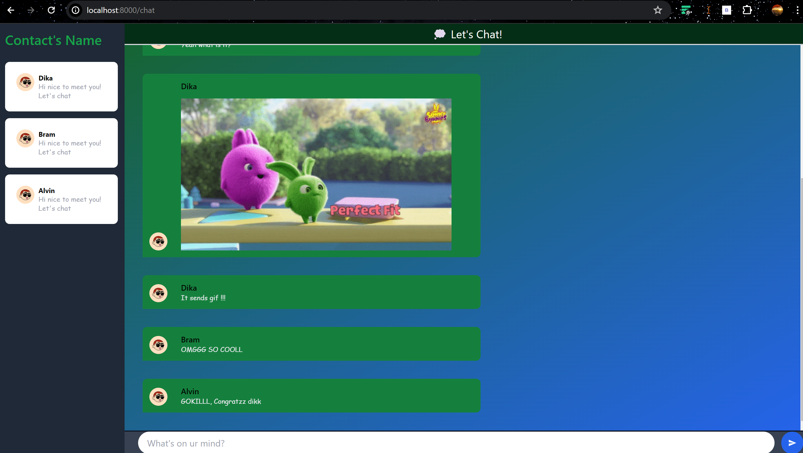

# YewChat 💬

> Source code for [Let’s Build a Websocket Chat Project With Rust and Yew 0.19 🦀](#)

## Install

1. Install the required toolchain dependencies:
   ```npm i```

2. Follow the YewChat post!

## Branches

This repository is divided to branches that correspond to the blog post sections:

* main - The starter code.
* routing - The code at the end of the Routing section.
* components-part1 - The code at the end of the Components-Phase 1 section.
* websockets - The code at the end of the Hello Websockets! section.
* components-part2 - The code at the end of the Components-Phase 2 section.
* websockets-part2 - The code at the end of the WebSockets-Phase 2 section.

### Experiment 3.1: Original code
  

### Experiment 3.2: Be Creative!



1. Styling Changes: I've adjusted the colors, fonts, and layout to improve visual appeal and readability. In the original code, the background colors were lighter and the text was smaller, while in my modified version, I opted for darker background shades with contrasting text colors for better visibility. Additionally, I introduced a different font style ("Comic Sans MS") to add a playful touch to the interface.
2. User Avatar Sizes: I've altered the size of user avatars in the user list and chat messages. In the original, they were larger, taking up more space, whereas in my modified version, they're slightly smaller, reducing visual clutter and allowing more content to be displayed on the screen.
3. User Status Indicators: I added a visual indicator of user status in the user list. While the original code didn't provide any indication of user online/offline status, in my modified version, I included a green circle emoji ("🟢") to signify that the user is online, enhancing the user experience by providing real-time status information.
4. Message Display: I refined the appearance of chat messages, including the sender's name, message content, and potential gif attachments. The original code presented messages in a simpler format without distinctive styling. In contrast, my modification introduces rounded message containers with background gradients, emphasizing the sender's name in a bold font style for better readability. Additionally, I added conditional rendering for gif attachments, displaying them as images if the message ends with ".gif," enhancing the chat's multimedia capabilities and visual appeal.
5. Input Field Styling: I adjusted the styling of the message input field, changing its background color, placeholder text, and border radius. The original input field had a lighter background color and a rounded border, while my modified version features a darker background with a green tint and a rounded border, aligning it visually with the overall theme of the chat interface.
6. Button Styling: I modified the styling of the message submission button, changing its background color, size, and icon appearance. The original button had a blue background with white text and a circular shape, while my modified version features a larger button with a green background, white text, and a circular shape, making it more prominent and visually consistent with other interface elements.